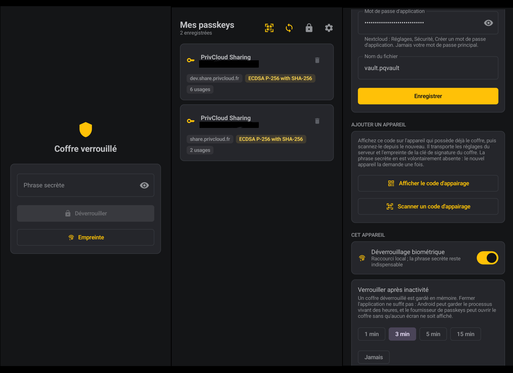

# PQ Vault

An Android passkey manager that syncs to your own WebDAV server (Nextcloud or anything
else). Built for de-Googled phones such as /e/OS, where no Google passkey provider exists.

It is the KeePassDX model applied to passkeys: an encrypted file you own, synced wherever
you want, that no third party can read.

<p align="center">
  
</p>

## Contents

- [PQ Vault](#pq-vault)
  - [Contents](#contents)
  - [What the app does](#what-the-app-does)
  - [Requirements](#requirements)
  - [Building](#building)
  - [Installing](#installing)
  - [Getting started](#getting-started)
  - [Configuring Nextcloud](#configuring-nextcloud)
  - [Enabling PQ Vault as a passkey provider](#enabling-pq-vault-as-a-passkey-provider)
  - [Using a passkey on another device](#using-a-passkey-on-another-device)
  - [Biometric unlock](#biometric-unlock)
  - [Locking the vault](#locking-the-vault)
  - [Adding a second device](#adding-a-second-device)
  - [Background sync](#background-sync)
  - [Trusted browsers](#trusted-browsers)
  - [Security model in brief](#security-model-in-brief)
  - [Troubleshooting](#troubleshooting)
  - [Project layout](#project-layout)
  - [Development](#development)
    - [Running the tests](#running-the-tests)
    - [End-to-end testing on an emulator](#end-to-end-testing-on-an-emulator)
    - [One trap worth knowing about](#one-trap-worth-knowing-about)
  - [Continuous integration](#continuous-integration)
  - [Known limitations](#known-limitations)
  - [Origin of the project](#origin-of-the-project)

## What the app does

- Registers with Android as a **credential provider**, so your passkeys are offered in the
  browser and in other apps, not only inside PQ Vault.
- Scans the **FIDO QR code shown by another device**, then acts as a nearby hybrid
  authenticator without depending on an external camera app or Google Play services.
- Keeps every passkey in an **encrypted vault file** (`vault.pqvault`) that you place on
  your own WebDAV server.
- **Merges** instead of overwriting: two phones that both worked offline each keep their
  additions.
- Uses **post-quantum cryptography where it actually helps**: sharing the vault key
  between devices (ML-KEM-768) and signing the file (ML-DSA-65), both hybrid with their
  classical counterparts.

What it does not do: manage your passwords. That is KeePassDX's job, and the two apps
coexist without conflict.

The interface is available in English and French, following the system language.

## Requirements

**To use it:**

| | |
|---|---|
| Android | 14 (API 34) minimum for the system provider, 11 (API 30) for the vault alone |
| Server | Any WebDAV: Nextcloud, ownCloud, Apache `mod_dav`, Seafile |

On Android 13 or earlier Android cannot offer a third-party passkey provider inside apps
on that phone. The vault and WebDAV sync still work, and the FIDO QR scanner can still use
those passkeys in a browser running on another computer or tablet.

**To build it:**

| | |
|---|---|
| JDK | 17 or later, with `javac` |
| Android SDK | Platform 36, build-tools 36.x |
| Gradle | Provided by the wrapper (9.0.0) |

Watch out for a common trap on Debian and Ubuntu: the `openjdk-17-jre` package does not
ship `javac`. Kotlin compilation will still succeed, and then the Android module fails on
`compileDebugJavaWithJavac` with a message about a "toolchain" that does not help. Check
with:

```bash
$JAVA_HOME/bin/javac -version
```

If the command is missing, install a real JDK (`openjdk-17-jdk`) and point `JAVA_HOME` at
it. To avoid re-exporting it on every command, set `org.gradle.java.home` once in
`~/.gradle/gradle.properties`, as shown under [Development](#development).

## Building

```bash
git clone https://github.com/Simthem/webauthn-kotlin.git pqvault
cd pqvault

export JAVA_HOME=/path/to/a/jdk17
export ANDROID_HOME=$HOME/Android/Sdk

./gradlew :app:assembleDebug
```

APKs land in `app/build/outputs/apk/debug/`, split per ABI:

| Build | Size |
|---|---|
| `app-arm64-v8a-debug.apk` | about 15 MB |
| `app-arm64-v8a-release.apk` | about 8 MB |

Both build types are shrunk with R8. Debug builds keep names and line numbers, so stack
traces and the debugger still work; only unreachable code is removed. Without that, the
Compose runtime alone pushes the APK past 35 MB.

If an incremental rebuild produces a noticeably larger APK, that is not the shrinking
failing. AGP patches the existing archive in place and can leave a hole the size of the
previous `classes.dex` inside it. `./gradlew clean` (or deleting `app/build`) before a
build you intend to distribute gives a compact file; the sizes above are from clean
builds.

Run every unit test (91 of them, no device or emulator needed):

```bash
./gradlew testAll
```

See [Running the tests](#running-the-tests) for what that covers and how to read the
output.

## Installing

Over USB, with debugging enabled on the phone:

```bash
adb install -r app/build/outputs/apk/debug/app-arm64-v8a-debug.apk
```

Or copy the APK to the phone and open it from a file manager. On /e/OS you will have to
allow installation from that source.

## Getting started

**1. Create the vault.** On first launch the app asks for a passphrase.

That passphrase is the only thing protecting your passkeys, and it **cannot be reset**. If
you lose it, the vault is permanently unreadable, including by you. Use a sequence of
random words (diceware) rather than a complicated single word: four or five random words
beat `P@ssw0rd!2026`.

The app accepts 12 characters minimum, but aim for 25 or more.

**2. Allow notifications.** Android asks on first launch. This is not cosmetic: it is how
the app tells you if your server returns a tampered or stale vault. Refusing these
notifications disables a protection.

At creation the device enrolls itself as a vault recipient, which is what makes background
sync possible without asking for your passphrase again.

## Configuring Nextcloud

**1. Create an app password.** In Nextcloud: *Settings*, then *Security*, and at the
bottom of the page *Create new app password*. Name it "PQ Vault".

Never use your main password. An app password is scoped, can be revoked from the web
interface without changing your account password, and keeps working if you enable
two-factor authentication.

**2. Create a folder** for the vault, for example `Passkeys`, at the root of your
Nextcloud files.

**3. Fill in the URL.** In PQ Vault, open settings (gear icon) and complete the *WebDAV
cloud* section. The URL follows this pattern:

```
https://YOUR-SERVER/remote.php/dav/files/YOUR-USERNAME/Passkeys
```

For example, for user `simon` on `cloud.example.org`:

```
https://cloud.example.org/remote.php/dav/files/simon/Passkeys
```

| Field | Value |
|---|---|
| Folder URL | the address above, with no trailing slash |
| Username | your Nextcloud login |
| App password | the one generated in step 1 |
| File name | `vault.pqvault` is fine |

**4. Save**, then go back to the main screen and tap the cloud icon to run a first sync.
The file should appear in your Nextcloud folder.

For a different WebDAV server, only the URL changes. For Apache `mod_dav` it is simply the
address of the shared folder.

## Enabling PQ Vault as a passkey provider

Without this step the app works but no site will offer it.

In Android settings: *Passwords and accounts*, or depending on the version *Settings*,
then *Passwords, passkeys and autofill*. Enable **PQ Vault** in the provider list.

On /e/OS the path is the same, except the list will probably be empty before you add PQ
Vault, since Google's provider is not installed.

To check from the command line that the system sees the service:

```bash
adb shell cmd package query-services --brief \
  -a android.service.credentials.CredentialProviderService
```

`com.pqvault.app/.provider.PqVaultCredentialProviderService` should appear in the list.

After that, when a site offers to create a passkey, pick PQ Vault in the sheet Android
shows. On the next sign-in the passkey is offered automatically.

## Using a passkey on another device

When a browser on a computer or tablet offers **Use a phone or tablet**, it displays a QR
code whose content starts with `FIDO:/`. The system camera on some de-Googled phones does
not know which app should open that URI, so PQ Vault has its own scanner:

1. Unlock PQ Vault on the phone.
2. Tap the amber QR scanner icon in the header of the passkey list.
3. Scan the QR code shown by the other device.
4. Check the site and account displayed by PQ Vault, then approve the request. A secure
   screen-lock confirmation is requested when the site requires user verification.

This is separate from **Scan a pairing code** in settings. Pairing connects a new PQ Vault
installation to your existing vault. The header scanner answers a live WebAuthn request
from another device.

The app also declares the `fido:` URI scheme. A camera application that understands it can
therefore offer PQ Vault directly, but this is only a convenience. The in-app scanner is
the path that works when the camera application treats the code as unknown text.

The remote flow is not a simple deep link. PQ Vault decodes the QR payload, opens the FIDO
tunnel, broadcasts the encrypted Bluetooth proximity proof, performs the Noise handshake,
then exchanges CTAP2 requests inside the encrypted channel. The tunnel sees only encrypted
traffic.

## Biometric unlock

In settings, under *This device*, turn on biometric unlock. A fingerprint is requested to
confirm.

What it actually does: the vault key is wrapped by a hardware-backed Keystore key that is
only released after a valid fingerprint. It is a **local shortcut**. Your passphrase
remains the root of trust and the vault stays portable between devices.

Two consequences worth knowing:

- Enrolling a new fingerprint in Android **permanently invalidates** that key. This is
  intended: someone who adds their finger to your stolen phone must not inherit your
  vault. The app will say so and ask for your passphrase, after which you can turn the
  option back on.
- The option stays greyed out if no fingerprint is enrolled in Android, or if the hardware
  does not provide a class-3 sensor.

## Locking the vault

An unlocked vault lives in memory, and closing the app is not a reliable way to close it:
Android can keep the process alive for hours, and the passkey provider can open the vault
with none of the app's screens on display at all.

So the vault locks itself once it has gone unused. In settings, under *This device*,
*Lock when idle* offers 1, 3, 5 and 15 minutes, or *Never*. The default is **3 minutes**.

What counts as use: touching the app, and signing in somewhere with one of your passkeys.
What does not: the system asking the provider which credentials exist, which happens
whenever any app raises a credential picker and is not something you did.

The lock icon in the toolbar still locks immediately, whatever the setting says.

## Adding a second device

The vault supports several recipients. An enrolled device can open it with its own key,
without ever knowing your passphrase.

The quickest route is the pairing QR code:

1. Install PQ Vault on the second device.
2. On the device that already holds the vault, open *Settings*, *Add a device*, and tap
   **Show pairing code**.
3. On the new device tap **Scan a pairing code** and point the camera at it.

4. The new device then shows **Restore the shared vault**. Enter your passphrase once and
   it downloads the vault, verifies it, and enrolls itself for background sync.

The code carries the server settings and the **fingerprint** of the vault's signing key,
so nothing has to be typed. It expires after five minutes, and the screen it is shown on
sets `FLAG_SECURE`: no screenshot, no screen recording, and no thumbnail in the recent
apps list, because the code contains your WebDAV app password in the clear.

The fingerprint rather than the key itself is not an optimisation. The hybrid
Ed25519 + ML-DSA-65 signing key is 1984 bytes, which is 2646 characters of base64url and
put the whole payload at about 3800 characters against a hard QR ceiling of 2953. A
SHA-256 digest is 43 characters and pins just as tightly: the key travels inside the vault
header anyway, and the digest is what proves it is the right one. The new device refuses
any vault whose signing key does not match it.

The code deliberately does **not** carry your passphrase. Someone photographing the screen
over your shoulder gets only the server coordinates, which are useless without the
passphrase that decrypts what is stored there.

Both devices then merge their changes on every sync. If you add a passkey on one while the
other is offline, nothing is lost: on reconnection the two sets are merged.

To remove a device (lost or sold) you currently have to create a new vault and re-enroll
the remaining devices. A revocation call exists in the code (`revokeDevice`) but is not yet
exposed in the interface.

## Background sync

It starts as soon as a WebDAV server is saved and the device is enrolled (settings show
the state). A sync runs roughly every 15 minutes when the network is available.

15 minutes is WorkManager's floor, and Android will stretch it further when the phone is
dozing. That is the right behaviour for a vault: saving battery beats syncing to the
second.

Background sync does not need your passphrase, because the device uses its own enrollment
key. It therefore works with the screen off and the vault locked.

## Trusted browsers

An ordinary app is identified by its APK signature, and PQ Vault checks with the site (via
`assetlinks.json`) that this app is actually allowed to use your passkeys for that domain.

A browser is different: it relays requests coming from web pages, so it declares an origin
of its own such as `https://github.com`. It can only be believed if you trust it. By
default **nothing is trusted and every web-origin request is refused**, because no implicit
trust ships with the app.

Settings lists the browsers installed on your device, with their real signing fingerprint
read from the installed APK, and you tick the ones you recognise. Nothing has to be typed
or looked up, and the app builds the allowlist itself.

Trust is bound to the signature that was present when you ticked the box, so an update
signed by a different key stops matching instead of silently inheriting the trust.

## Security model in brief

| Layer | Algorithm | Post-quantum |
|---|---|---|
| Vault contents | XChaCha20-Poly1305 | Yes, inherently |
| Key derivation | Argon2id, 64 MiB, 3 passes | Yes, inherently |
| Device sharing | X25519 + ML-KEM-768 | Yes |
| File signature | Ed25519 + ML-DSA-65 | Yes |
| Passkey signature | ES256 (P-256) | No, dictated by sites |

Two points that are often misunderstood:

**Passkeys cannot be signed post-quantum.** The algorithm is chosen by each site through
`pubKeyCredParams`. The COSE identifiers for ML-DSA are registered with IANA, but no site
can verify them yet. A passkey signed with ML-DSA today would be unusable. The code offers
ML-DSA during negotiation and falls back to ES256, so the day a site accepts it, it will
work with no change.

**The vault contents are already quantum-resistant.** They are protected by a symmetric
key derived from your passphrase, and Grover's algorithm only halves the effective
security: 256 bits still leaves 128. Post-quantum becomes useful the moment asymmetric
cryptography enters the picture, which is when sharing the key between devices. That
wrapped copy sits on a server for years, making it a textbook harvest-now-decrypt-later
target.

**The trade-off to accept.** Passkey private keys are software keys, inside the file. That
is what makes backup and sync possible, and it is exactly what the upstream library could
not do. In exchange, an attacker who obtains the file **and** a weak passphrase obtains
everything. It is the same bargain KeePass users make, with the difference that it should
be chosen knowingly. Your passphrase is the only thing between a stolen file and your
accounts.

Which is also why the vault does not stay open indefinitely: see
[Locking the vault](#locking-the-vault). An unlocked vault holds the master key in memory,
and an app left open on a desk is a different threat from a stolen file, but not a smaller
one.

The full detail, including replay protection and merge logic, is in
[docs/ARCHITECTURE.md](docs/ARCHITECTURE.md).

## Troubleshooting

**"Remote vault refused" with a security alert.**
The file fetched from the server fails its integrity checks: invalid signature, unknown
signing key, or a version older than one already seen. This is never a network glitch.
Either someone tampered with the file, or you restored an old backup over it, or you are
pointing at someone else's vault. Check the file on the server first.

If, and only if, the cause is a version rollback, the alert offers **Accept the server
version**. Take it when you have just restored the server from a backup and you know why
it is behind. It makes the server's copy the new reference; your local passkeys are merged
into it, not replaced. A bad signature or an unknown signer never offers that button,
because no legitimate situation produces one.

**The vault keeps locking while I am using it.**
The idle lock defaults to three minutes. Change it in settings under *This device*,
*Lock when idle*, or set it to *Never*. The system querying the provider for available
credentials does not count as activity: only touching the app and signing in with a
passkey do.

**The pairing code says it is too long for a QR code.**
Your WebDAV address is unusually long. Shorten it, for example by putting the vault nearer
the root of the share, and try again.

**The second device only offers to create a new vault.**
It has not been paired yet, so it has no server to restore from. Scan a pairing code from
the device that holds the vault first; the restore option appears once the server settings
are in place. Creating a vault there instead gives you two unrelated vaults fighting over
one file on the server.

**"The remote vault does not open with this key."**
The file on the server belongs to a different vault, or its key was rotated without this
device being re-enrolled. Open it with your passphrase to re-enroll the device.

**Sync fails with HTTP 401.**
Wrong or revoked app password. Generate a new one in Nextcloud.

**Sync fails with HTTP 404 or 409.**
The folder does not exist on the server. Create it from the Nextcloud web interface: the
app does not create the directory tree.

**PQ Vault does not appear in the provider list.**
Check that Android 14 or later is installed, then that the service is declared, using the
`adb shell cmd package query-services` command given above. Rebooting the phone after
installing sometimes helps.

**No passkey offered on a site although the vault holds one.**
Three possible causes: PQ Vault is not enabled as a provider, the browser is not ticked in
the trusted list, or the site publishes an `assetlinks.json` that does not recognise the
app making the request.

**The FIDO QR scanner connects but the computer never sees the phone.**
Check that Bluetooth is enabled and that PQ Vault has the nearby-device permission. The
other device needs Bluetooth too because the encrypted advert proves physical proximity;
the WebSocket tunnel alone is intentionally insufficient.

**The biometric option stays greyed out.**
No fingerprint is enrolled in Android, or the sensor is not class 3. Enrol a fingerprint in
the system settings first.

**Biometric unlock stopped working.**
A new fingerprint was enrolled, which invalidates the key by design. Open the vault with
your passphrase, then turn the option back on.

**The build fails on `compileDebugJavaWithJavac`.**
Your `JAVA_HOME` points at a JRE. See [Requirements](#requirements).

## Project layout

```
pqvault/
  vault/        Vault core in pure Kotlin, testable without Android
    crypto/     XChaCha20-Poly1305, Argon2id, hybrid KEM and signature
    format/     File format, header, recipients
    merge/      Merging and conflict resolution
    sync/       WebDAV engine, independent of the HTTP stack
    webauthn/   Software authenticator, COSE, authenticatorData
    hybrid/     FIDO QR, caBLE key derivation, Noise and CTAP2 codec
  app/          Android application
    provider/   CredentialProviderService, caller verification
    pairing/    QR pairing payload, encoder and scanner
    hybrid/     WebSocket tunnel and encrypted BLE proximity advert
    data/       Repository, encrypted settings, device identity
    security/   Biometric unlock
    sync/       OkHttp WebDAV client, periodic worker
    ui/         Compose interface
  rptest/       Development harness: a fake relying party that requests a passkey
  webauthn/     Original LINE library, kept but unused
  docs/         Architecture, original library README
```

The `vault` module does not depend on Android. That is deliberate: all the delicate logic,
meaning the cryptography, the file format and the merge, is testable on a development
machine with no emulator.

## Development

```bash
./gradlew testAll                   # every unit test, both modules
./gradlew verify                    # the tests plus Android Lint, exactly what CI runs
./gradlew :app:assembleDebug        # debug APK
./gradlew :rptest:assembleDebug     # fake relying party for end-to-end testing
```

If your `java` is a JRE, put the JDK path in `~/.gradle/gradle.properties` once instead of
exporting `JAVA_HOME` on every command. That file is per-user and never committed:

```properties
org.gradle.java.home=/usr/lib/jvm/jdk-17-oracle-x64
```

### Running the tests

91 unit tests, none of which need a device or an emulator.

```bash
./gradlew testAll                 # both modules, 91 tests
./gradlew :vault:test             # vault core only, 83 tests
./gradlew :app:testDebugUnitTest  # app module only, 8 tests
```

Each task prints every test name and a count when it finishes:

```
PairingPayloadTest > a pairing code fits in a QR code() PASSED

8 tests: 8 passed, 0 failed, 0 skipped
```

**If you see no test output at all, nothing ran.** Gradle skips a task whose inputs have
not changed and reports `4 actionable tasks: 4 up-to-date`, which looks exactly like a
successful run. Force it:

```bash
./gradlew :vault:test --rerun     # re-run this task even if it is up to date
./gradlew testAll --rerun-tasks   # re-run everything, including compilation
```

Two other things worth knowing. `:app:test` builds *and* runs both the debug and release
unit test variants, so it is roughly twice the work of `:app:testDebugUnitTest` for the
same result. And a failing run leaves a browsable report behind:

```
vault/build/reports/tests/test/index.html
app/build/reports/tests/testDebugUnitTest/index.html
```

To run a single test class or method:

```bash
./gradlew :vault:test --tests '*VaultSyncEngineTest*'
./gradlew :vault:test --tests '*VaultSyncEngineTest.repeated sync cycles*'
```

The suite covers:

- cryptographic primitives against official vectors (CFRG XChaCha20 draft, cross-checked
  with libsodium), and the Argon2id cost bounds that stop a hostile vault header asking
  for terabytes of working memory;
- vault security properties: wrong passphrase, tampered file, unknown signer, rollback to
  an earlier version;
- merge semantics, including the rule that the signature counter must never go backwards,
  and the rule that a lossless merge is not reported as a conflict;
- the sync engine against a fake WebDAV server that writes concurrently, replays old
  versions and serves corrupted files, including local edits between syncs;
- WebAuthn object generation, with independent signature verification;
- FIDO digit decoding, CTAP2 request/response maps, and an independent KNpsk0 initiator
  interoperating with the hybrid Noise responder;
- the pairing payload, including the assertion that it still fits inside a QR code.

Not covered automatically: the idle lock and the biometric path, both of which need a
`Context` and the Android Keystore.

### End-to-end testing on an emulator

```bash
avdmanager create avd -n pqvault -k "system-images;android-35;google_apis;x86_64" -d pixel_6
emulator -avd pqvault -no-window -gpu swiftshader_indirect &

adb install -r app/build/outputs/apk/debug/app-x86_64-debug.apk
adb install -r rptest/build/outputs/apk/debug/rptest-debug.apk
adb shell settings put secure credential_service \
  "com.pqvault.app/com.pqvault.app.provider.PqVaultCredentialProviderService"
adb shell am start -n com.pqvault.rptest/.RpTestActivity
```

The `rptest` app asks Credential Manager for a passkey exactly as a real app would, which
is the only way to confirm that PQ Vault is genuinely offered in the system picker.

### One trap worth knowing about

In `res/xml/provider.xml`, the password capability is namespaced `android.credentials`, but
the passkey one is `androidx.credentials`. The system matches that string against the
requested credential type, so the wrong prefix means passkey requests are silently never
routed to the app, and it simply never appears in the picker. There is no error message.

## Continuous integration

Both a GitHub Actions workflow ([.github/workflows/ci.yml](.github/workflows/ci.yml)) and
a GitLab pipeline ([.gitlab-ci.yml](.gitlab-ci.yml)) are provided, running the same
checks. `./gradlew verify` locally is the same set minus the scanners, so a green run
before pushing is a good predictor of a green pipeline.

| Check | What it is for |
|---|---|
| Gradle wrapper checksum | A tampered `gradle-wrapper.jar` runs arbitrary code on every build, on every machine, including the runner. This is the cheapest supply-chain check a Gradle project has. |
| Unit tests | The 91 tests above, with JUnit reports published in both platforms. |
| Android Lint | Runs over `app` **and** `vault`, and publishes SARIF so findings land in the code-scanning view rather than an HTML file nobody opens. |
| CodeQL | `security-and-quality` over `java-kotlin` and the workflows themselves. Built manually rather than with autobuild, which guesses at an Android project and often analyses a fraction of the sources while still reporting success. |
| Snyk | Open Source and Code. Skipped rather than failed when `SNYK_TOKEN` is absent, so a fork's pull request is not red for a secret it was never going to have. |
| OSV-Scanner | Draws on a different set of advisory databases than Snyk and GitLab's Gemnasium, and the overlap is not total. Gradle has no lockfile here, so one is generated on the fly with `--write-verification-metadata`. |
| Gitleaks / Secret Detection | Over the full history: a credential committed and then removed is still leaked. |
| Trivy | Filesystem, secrets and misconfiguration. |
| Dependency Review / Gemnasium | What a change adds to the dependency graph, licences included. |
| Release signing check | Asserts the release APK comes out **unsigned** when no keystore is configured, so it can never quietly inherit the debug key. |

Dependabot ([.github/dependabot.yml](.github/dependabot.yml)) opens the pull requests that
act on what the scanners find, grouped by family so Compose and AndroidX are reviewed
together rather than fifteen times.

**Release signing.** The release build is signed only when a keystore is configured, via
`pqvaultStoreFile` in `~/.gradle/gradle.properties` or `PQVAULT_STORE_FILE` in the
environment, plus the matching password, alias and key password. Without them the APK is
left unsigned and the build says so. That is deliberate: for a credential provider the
signing certificate *is* the app's identity. It is what `apk-key-hash` origins are derived
from, what sites pin in `assetlinks.json`, and what decides whether an update may replace
the install.

## Known limitations

- **Device revocation is not exposed in the interface**, although it exists in the code.
- **Nextcloud round-trips are exercised by hand, not by CI.** The engine is covered by
  tests against a simulated server, including concurrent writes, replayed versions and a
  hostile server, but nothing automated talks to a real one.
- **The idle lock and the biometric path have no automated tests.** Both need an Android
  `Context` and the Keystore, so covering them means adding Robolectric or an
  instrumented suite.
- **Biometrics is only verified at compile time.** The emulator used has no sensor; the
  availability detection does behave correctly.
- **Attestation is `none`.** A self-hosted vault has no manufacturer certificate chain to
  present. Sites that demand verifiable attestation will refuse the app, which is the
  correct behaviour.
- **The hybrid flow still needs validation on physical hardware.** Its QR encoding,
  cryptography and CTAP messages are covered by JVM tests, but an emulator cannot validate
  Android BLE advertising against desktop browsers and their public tunnel service.

## Origin of the project

This repository is a fork of [line/webauthn-kotlin](https://github.com/line/webauthn-kotlin),
a library that lets an app act as a WebAuthn authenticator for its own server.

Two reasons made it unusable as-is:

1. It generates every private key inside the `AndroidKeyStore`. Those keys are not
   exportable, by hardware design, so nothing can be backed up or synced. What the database
   holds is only metadata, useless on another phone.
2. It does not implement `CredentialProviderService`, the only interface through which an
   app can supply passkeys to other apps and to the browser.

PQ Vault therefore takes the problem back to the cryptographic layer: software keys in an
encrypted vault, plus a system provider. The original library is kept in the `webauthn/`
module and its README in [docs/UPSTREAM-LIBRARY.md](docs/UPSTREAM-LIBRARY.md).

Apache 2.0 licensed, like the original project.
